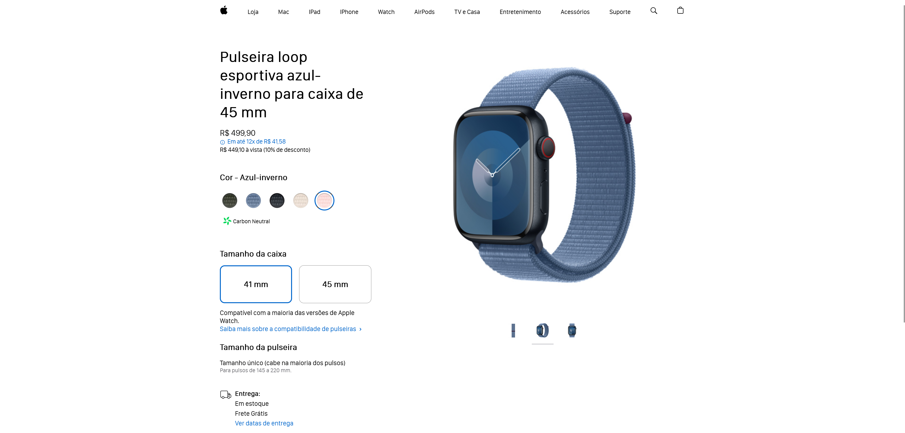

# Projeto Aula 02 - Intensivão JavaScript 2024
Réplica do Site da Apple Watch

<h1 align="center">
  
</h1>

## 💻 Tecnologias Utilizadas nesse Projeto

  
  
  

 

## Link do Deploy
https://dom-casmurro.vercel.app/
